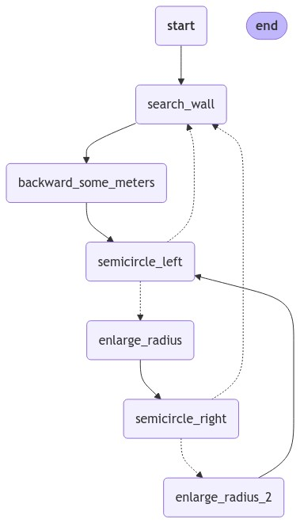
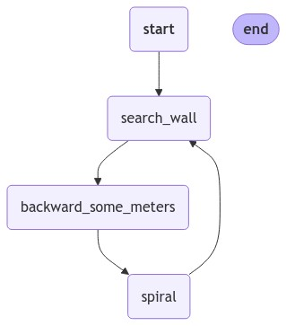
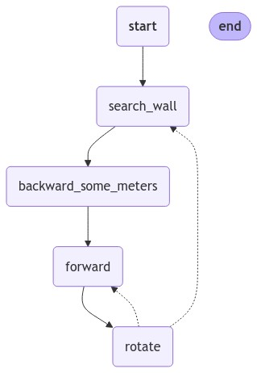

# 🧹 Practice 1: Vacuum Cleaner Algorithm Simulation

## 🎯 Objective
The goal of this practice is to develop an algorithm for a vacuum cleaner to clean a house without using localization attributes. Since localization is not enabled, the program must follow a pseudo-random approach, attempting to cover the entire house by randomizing paths until the house is fully cleaned.

## 🧠 Algorithms
Three different algorithms have been tested in the main repository. However, in this report, we will only present the video of the algorithm that best meets the requirements.

### 1. **Semicircles**
The idea behind this algorithm is to move forward until hitting a wall, then cover half a circle by driving along the half perimeter of the corresponding semicircle. If the robot's bumper is triggered, the loop is repeated. The main weakness of this algorithm is the complexity of the path generated.

    

> **Weakness**: The graph generated can become too complex and inefficient for certain layouts.

> This algorithm can be found at the commit [0e00ba4].

  

### 2. **Spiral**
This algorithm simplifies the semicircles method by making it more robust. Instead of half circles, it uses incremental speed combined with a rotational movement to create spirals. The main downside is its inability to clean corners and its high sensitivity to getting stuck in tight spaces.

    

> **Weakness**: Struggles with cleaning corners and getting stuck in confined areas.

> This algorithm can be found at the commit [7151a9e].

  

### 3. **Angular Spiral**
This algorithm improves on the spiral method by introducing 90º rotations to form a diamond-shaped path (a rhombus). Due to the noise in the robot's turning mechanics, the shape deviates from a perfect square, but this modification improves the balance between exploration and coverage in the cleaning process.

    

> **Strength**: Achieves a better balance between exploration and coverage.

> This algorithm can be found at the last version.

 

## 🏆 Final Results
After evaluating the three algorithms, the final results show that the **Angular Spiral** algorithm provides the most effective cleaning coverage, balancing both simplicity and performance.
